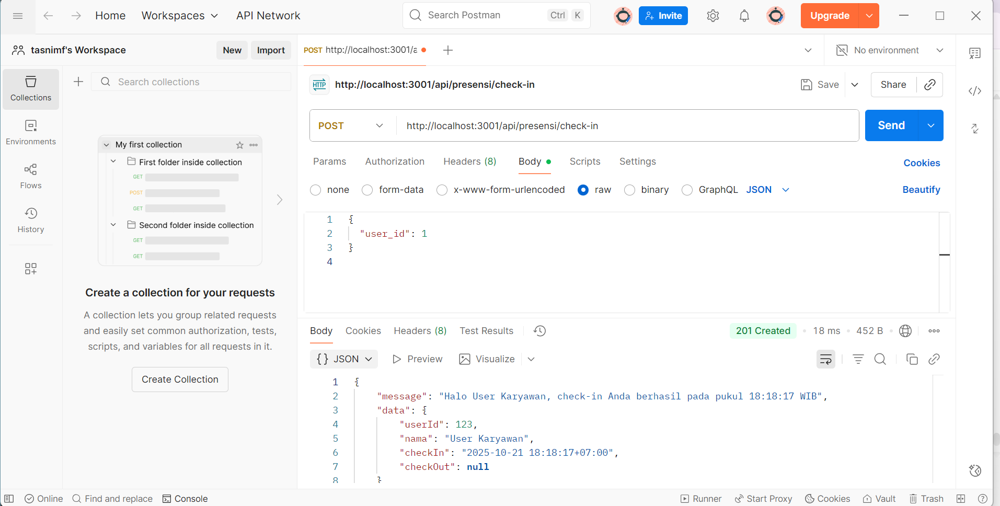
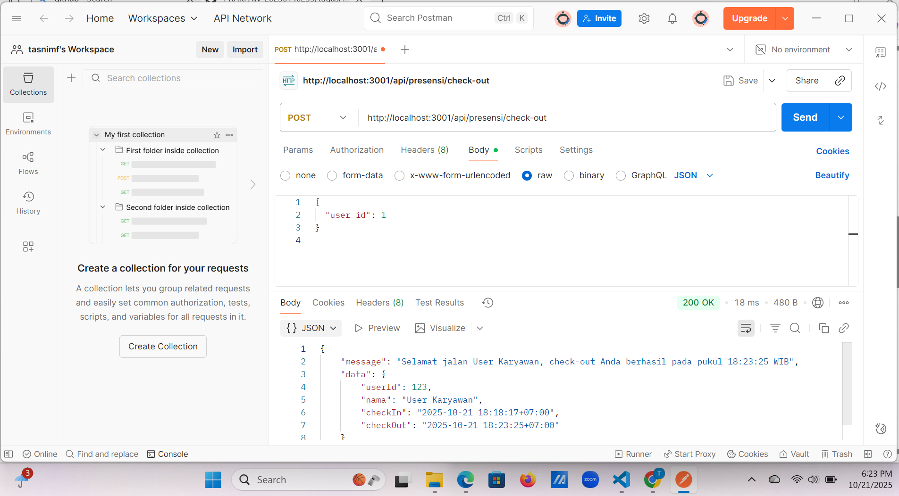
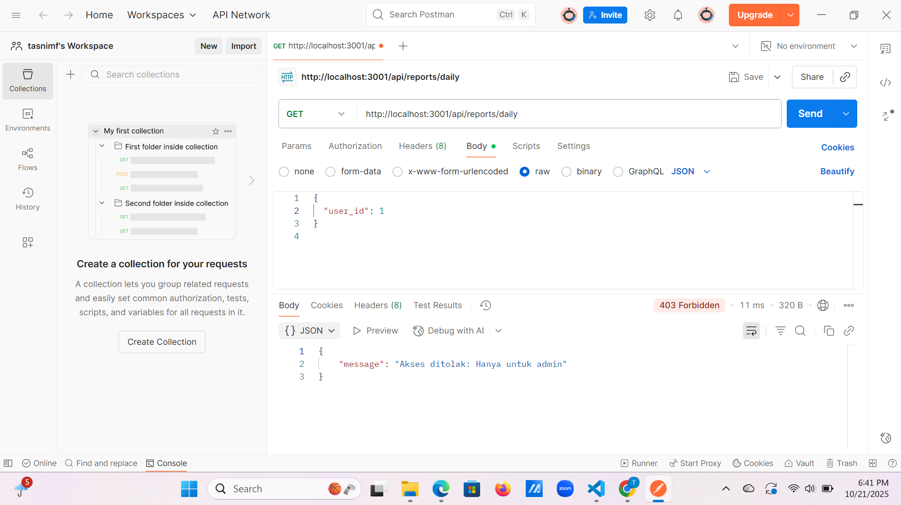

# Tugas 3 - API Presensi

## 1. Endpoint: `presensi/check-in`

## 2. Endpoint: `presensi/check-in` (kedua kali)

## 3. Endpoint: `presensi/check-out`

## 4. Endpoint: `presensi/check-out` tanpa check-in

## 5. Endpoint: `reports/daily`

