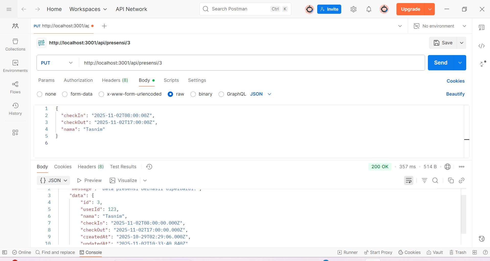
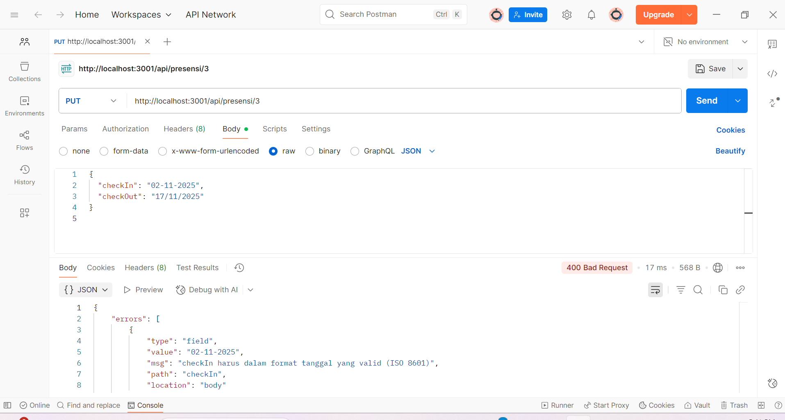
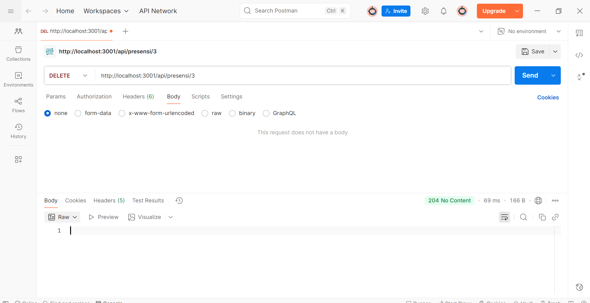
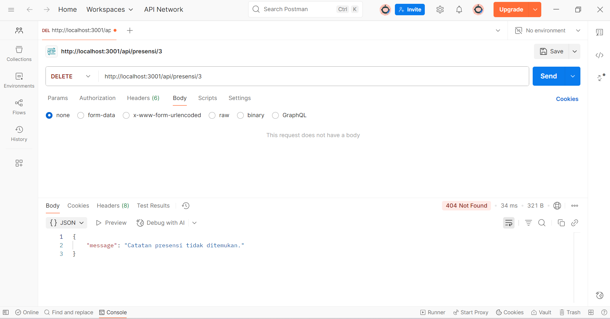
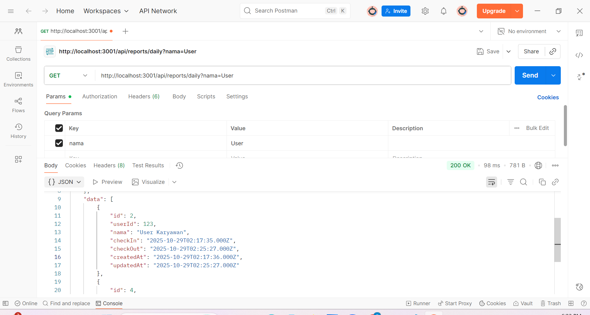
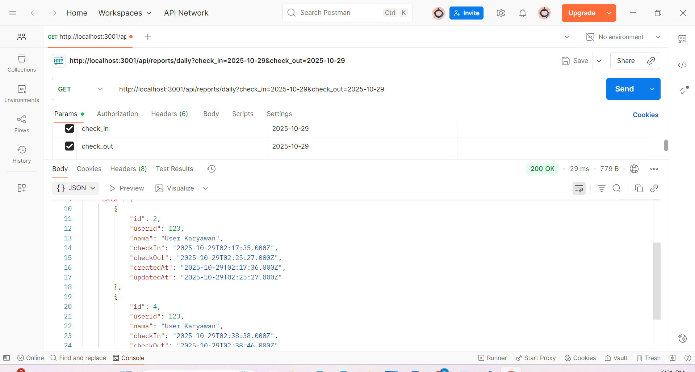

# Tugas 5

Tampilan Endpoint Update Data Presensi:  

Tampilan Endpoint Update Jika Format Tanggal Tidak Valid:  

Tampilan Endpoint Delete Data:  

Tampilan Endpoint Delete Data:  

Tampilan Endpoint Search Berdasarkan Nama:  

Tampilan Endpoint Search Berdasarkan Tanggal:  

