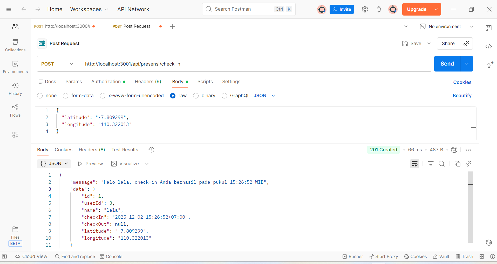
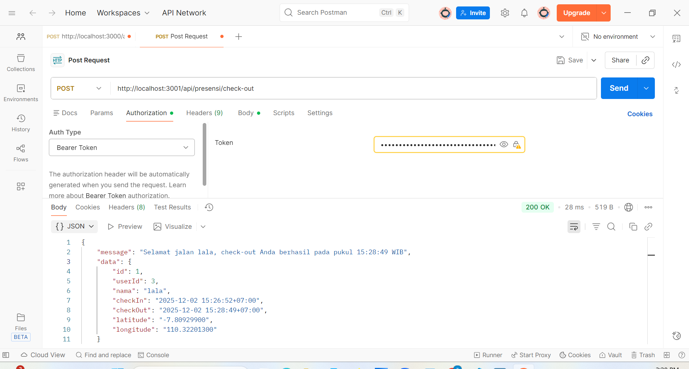
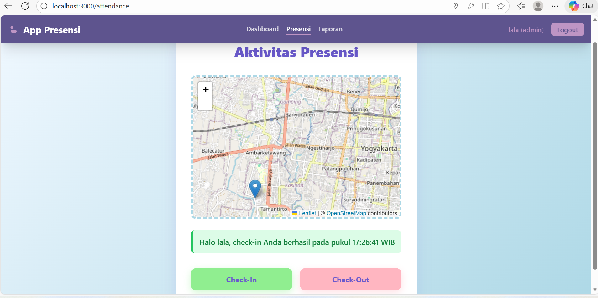
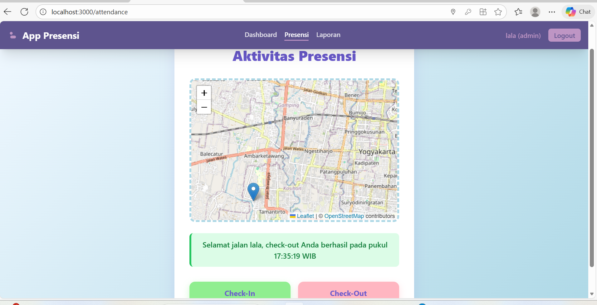
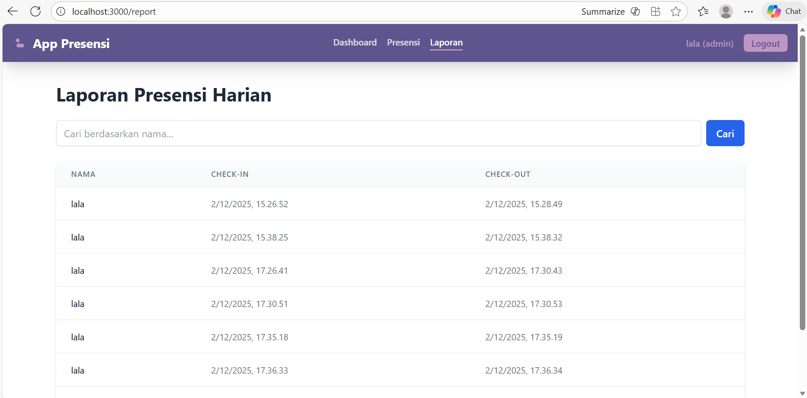
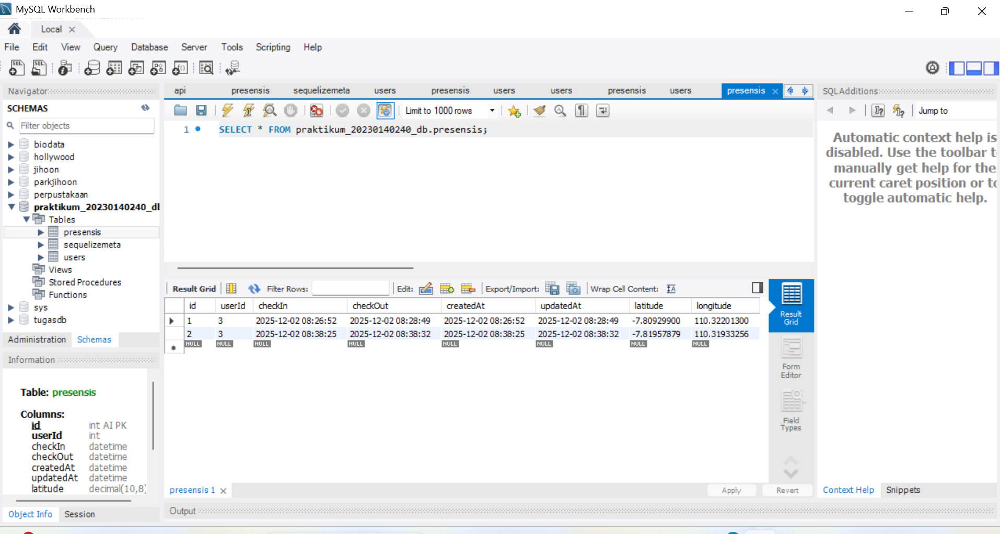

## Endpoint presensi/check-in (bearer token dan body latitude, longitude)

### Check-in berhasil

### Check-out berhasil

## Tampilan halaman report 

## Screenshote tabel presensi di database

